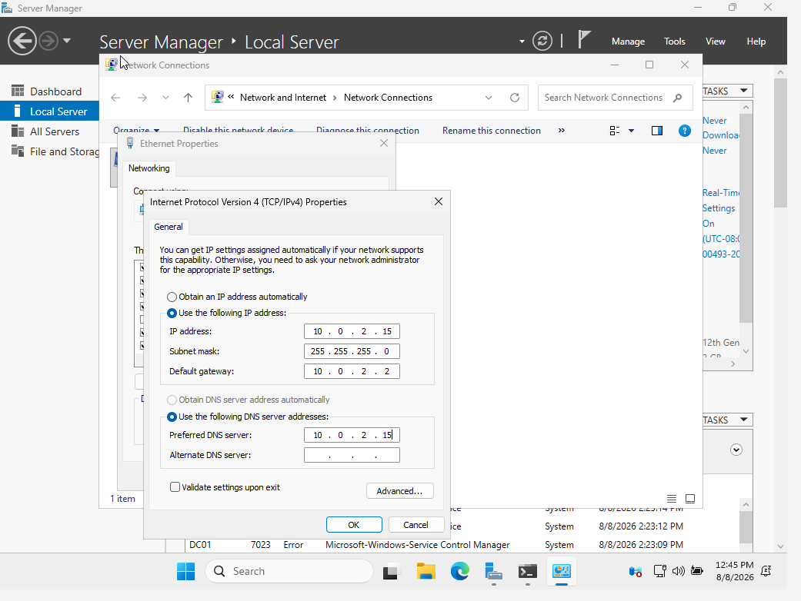
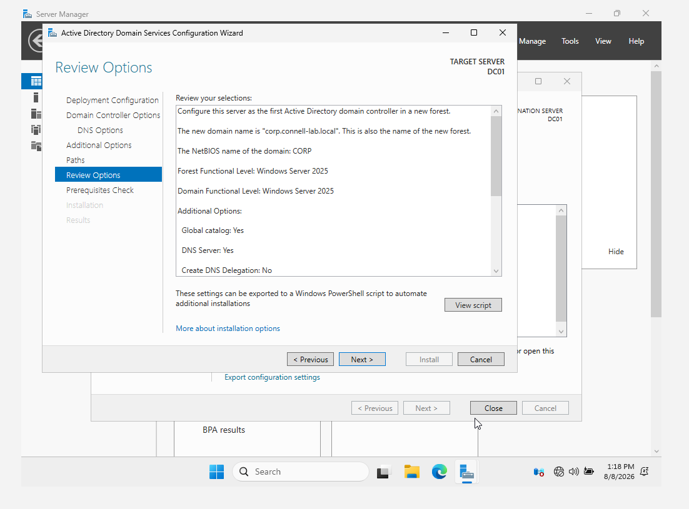
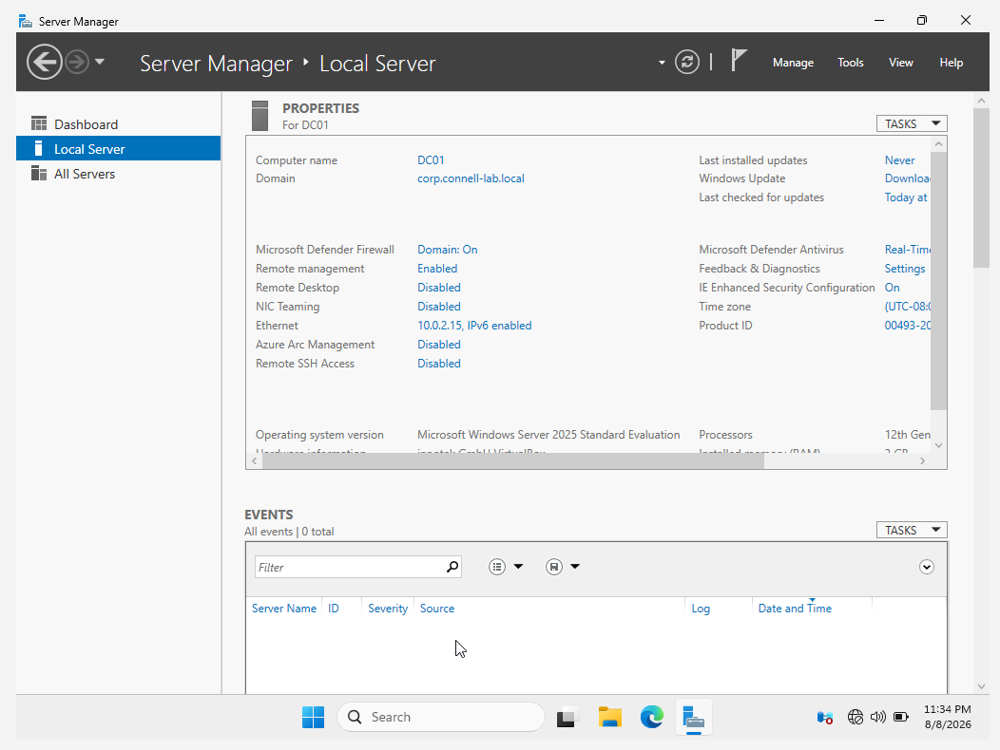
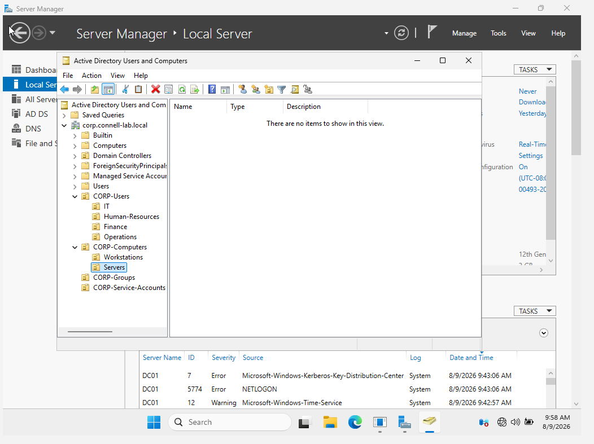
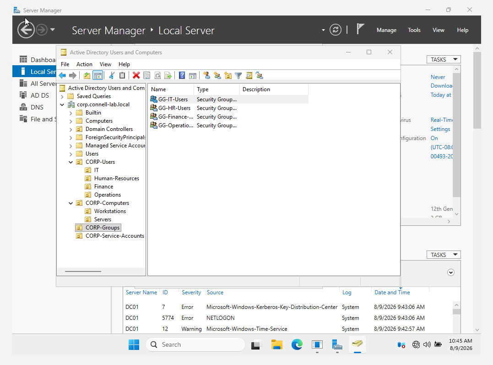
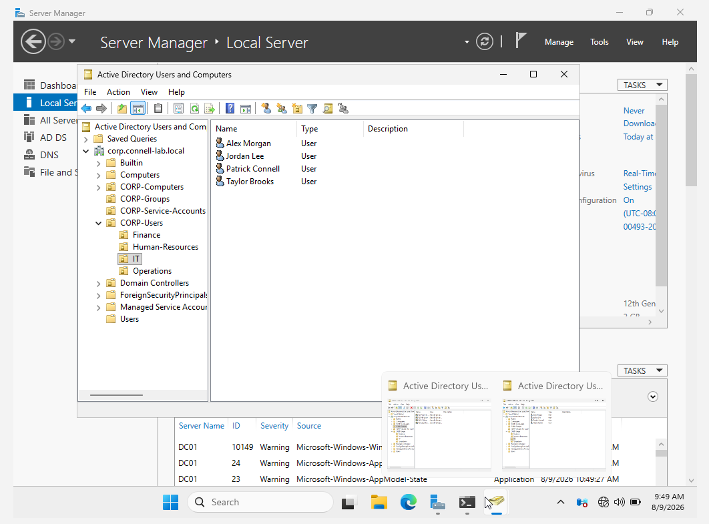

# Active Directory Enterprise Lab

## Project Overview

This project documents the design and deployment of a simulated enterprise Microsoft Active Directory environment using Windows Server 2025 and Oracle VirtualBox.

The lab was built to develop hands-on experience with Windows Server administration, Active Directory Domain Services (AD DS), DNS, organizational unit design, security groups, role-based access control (RBAC), and PowerShell automation.

## Lab Objectives

- Deploy Windows Server 2025 in a virtualized environment
- Configure a static IPv4 address for infrastructure services
- Install Active Directory Domain Services and DNS
- Create a new Active Directory forest and domain
- Design an enterprise organizational unit structure
- Implement security groups for role-based access
- Create and manage domain user accounts
- Automate user provisioning with PowerShell
- Apply security-focused identity and access management practices

## Environment

| Component | Configuration |
|---|---|
| Hypervisor | Oracle VirtualBox |
| Server OS | Windows Server 2025 Standard Evaluation |
| Domain Controller | DC01 |
| Domain | corp.connell-lab.local |
| NetBIOS Domain | CORP |
| DC IPv4 Address | 10.0.2.15 |
| Server Memory | 3 GB |
| Server vCPU | 2 |
| Virtual Disk | 60 GB |

## Active Directory Architecture

```text
corp.connell-lab.local
│
├── Domain Controllers
│   └── DC01
│
├── CORP-Users
│   ├── IT
│   ├── Human-Resources
│   ├── Finance
│   └── Operations
│
├── CORP-Computers
│   ├── Workstations
│   └── Servers
│
├── CORP-Groups
│   ├── GG-IT-Users
│   ├── GG-HR-Users
│   ├── GG-Finance-Users
│   └── GG-Operations-Users
│
└── CORP-Service-Accounts
```

## Active Directory Deployment

Windows Server 2025 was configured as the first domain controller for a new Active Directory forest.

**Forest:** `corp.connell-lab.local`

**Domain:** `corp.connell-lab.local`

**NetBIOS:** `CORP`

DC01 provides:

- Active Directory Domain Services
- DNS
- Global Catalog
- Group Policy infrastructure

## Identity and Access Management

Departmental organizational units were created to logically separate users according to business function.

Global security groups were created for:

- IT
- Human Resources
- Finance
- Operations

Users are assigned to security groups rather than receiving permissions directly. This provides a scalable foundation for role-based access control and centralized permission management.

## PowerShell Automation

After manually creating and configuring initial Active Directory objects, PowerShell was used to automate user provisioning.

The automation performs the following tasks:

- Creates domain user accounts
- Generates user principal names
- Places users into their appropriate departmental OU
- Enables user accounts
- Requires password change at first logon
- Adds users to their corresponding security group

Credentials are not stored in the public version of the script. The administrator is prompted to securely provide the temporary password at runtime.

## Security Concepts Demonstrated

- Role-Based Access Control (RBAC)
- Group-based authorization
- Organizational Unit design
- Separation of privileged and standard accounts
- Centralized identity management
- Secure credential handling
- Least-privilege principles
- Automated identity provisioning

## Technologies Used

- Windows Server 2025
- Active Directory Domain Services
- DNS
- Group Policy Management
- PowerShell
- Oracle VirtualBox
## Implementation Screenshots

### Static IPv4 Configuration

DC01 was configured with a static IPv4 address to provide consistent network services for Active Directory and DNS.



### Active Directory Forest Deployment

A new Active Directory forest was created using the domain `corp.connell-lab.local`.



### Domain Controller Verification

DC01 was successfully promoted to a domain controller and joined to the new domain.



### Organizational Unit Structure

Departmental and infrastructure OUs were created to support centralized administration and future Group Policy application.



### Security Group Membership

Users were assigned to departmental security groups to support group-based access control.



### PowerShell Automated User Provisioning

PowerShell was used to automate creation of fictional enterprise users and assign them to the appropriate OUs and security groups.


## Project Status

### Completed

- [x] Windows Server 2025 deployment
- [x] Static IPv4 configuration
- [x] Active Directory Domain Services installation
- [x] New forest/domain deployment
- [x] DNS installation
- [x] Organizational Unit structure
- [x] Security group creation
- [x] Domain user creation
- [x] PowerShell automated user provisioning

### Planned

- [ ] Windows 11 client deployment
- [ ] Domain-join CLIENT01
- [ ] Group Policy configuration
- [ ] Password and account-lockout policies
- [ ] Workstation security policies
- [ ] Windows event auditing
- [ ] PowerShell administration enhancements
- [ ] Security monitoring / SIEM integration

## Lessons Learned

This project provided practical experience designing and administering a Windows Active Directory environment from the ground up. The lab reinforced the importance of structured identity management, group-based authorization, DNS integration, documentation, and automation.

Future phases will expand the environment with domain-joined endpoints, Group Policy security controls, auditing, and security monitoring.
